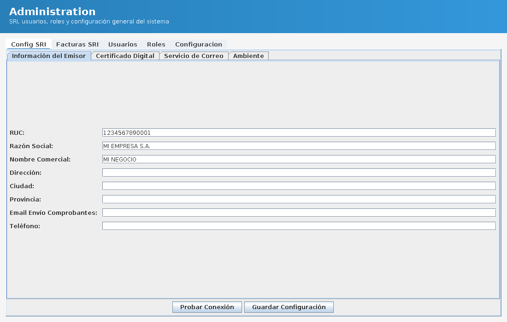
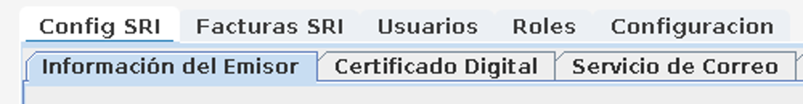

# ChromisposEC - Edición Ecuador Open Source 🇪🇨

¡Bienvenido al fork comunitario oficial de **Chromis POS adaptado 100% para Ecuador**!

Este proyecto nació con el objetivo de dotar a los negocios ecuatorianos de un sistema de Punto de Venta (POS) robusto, libre y completamente integrado con las complejas normativas del Servicio de Rentas Internas (SRI).

## 🏆 Créditos y Autoría
Este fork fue arquitectado, adaptado y donado a la comunidad Open-Source por:
**Riccijandro** 

## ✨ Principales Mejoras y Aportes

1. **Facturación Electrónica Nativa (Ficha Técnica SRI v2.26 - 2024)**
   - Generación de XML totalmente apegada a la ley.
   - Cálculo dinámico de impuestos (Soporte nativo para 0%, 5%, 12%, 14%, 15% y los que vengan).
   
2. **Interfaz de Configuración "Todo en Uno"**
   - Ya no es necesario lidiar con archivos de texto `.properties`.
   - Se construyó un panel nativo en el menú del sistema ("Administración") para cargar RUC, Razones Sociales, base de datos y la firma electrónica (`.p12`).

3. **Instalador Profesional Integrado**
   - El código fuente incluye un script `ChromisEC_Installer.iss` que permite compilar un archivo `Setup.exe` profesional en segundos usando Inno Setup.
   - Permite que el sistema sea 100% portable empaquetando Java.

4. **Panel de Administración Centralizado** *(rediseñado)*
   - Un único punto de entrada (menú "Administración") con pestañas para **Configuración SRI**, **Facturas SRI**, **Usuarios**, **Roles** y **Configuración General** del sistema.
   - Antes existían varias pantallas distintas que se solapaban entre sí (Admin Premium, Dashboard Central y hasta una app suelta `ChromisAdmin.jar`); todo eso se consolidó en un solo panel para evitar confusión sobre "dónde se configura qué".
   - Header con degradado azul y pestañas con estilo premium (esquinas redondeadas, acento de color en la pestaña activa):

     

     Detalle de las pestañas:

     

## 🚀 ¿Cómo empezar?
1. Clona el repositorio.
2. Abre tu instalador y compila con Inno Setup.
3. Instálalo en cualquier PC Windows, inicia sesión y dirígete al menú **"Administración"** en el panel izquierdo (ahí están SRI, usuarios, roles y la configuración general). Productos, categorías e impuestos siguen en el menú "Mantenimiento e Inventario".

## 📞 Contacto y Soporte
Si necesitas asistencia con la instalación, tienes problemas con la validación de firmas `.p12`, o buscas adaptar nuevas funcionalidades para tu negocio en Ecuador, puedes contactarme directamente:

- 📧 **Correo Electrónico:** richardrodriguez271@gmail.com
- 💬 **WhatsApp:** 0983185069
- 🌐 **GitHub/LinkedIn:** [@riccijandro](https://github.com/riccijandro)

---
**Licencia:** GNU General Public License v3.0 (Igual que el proyecto base Chromis POS).
